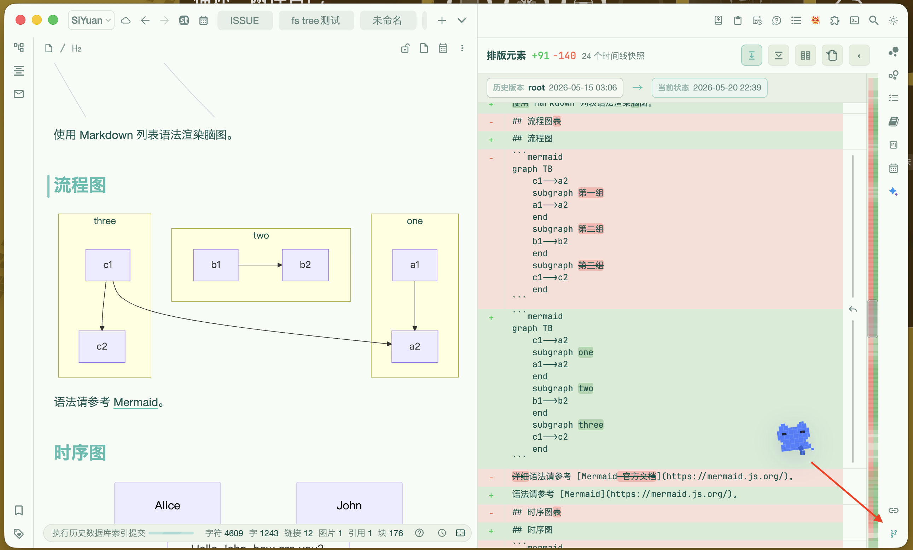

# SiYuan Sisyphus MCP & CLI

<p align="left">
  <a href="https://www.npmjs.com/package/siyuan-sisyphus">
    
  </a>
  <a href="https://github.com/yangtaihong59/siyuan-plugins-mcp-sisyphus/blob/main/LICENSE">
    
  </a>
  <a href="https://yangtaihong59.github.io/siyuan-plugins-mcp-sisyphus/">
    
  </a>
  <a href="https://github.com/yangtaihong59/siyuan-plugins-mcp-sisyphus/releases">
    
  </a>
</p>

<p align="left">
  <a href="https://github.com/yangtaihong59/siyuan-plugins-mcp-sisyphus/blob/main/README.md">English</a> |
  <a href="https://github.com/yangtaihong59/siyuan-plugins-mcp-sisyphus/blob/main/README_zh_CN.md">中文</a> |
  <a href="https://yangtaihong59.github.io/siyuan-plugins-mcp-sisyphus/">Documentation</a>
</p>

> **Latest:** `v0.4.7` — Improved Document Timeline scroll synchronization, made dock registration more reliable after startup, and added support links.

<p align="center">
  
</p>
<p align="center"><em>Document Timeline: named snapshots, visual diff, and rollback for SiYuan notes.</em></p>

## What It Is

SiYuan Sisyphus lets AI agents safely read, search, edit, and organize your SiYuan workspace.

It ships as both a SiYuan plugin and a standalone CLI:

- **MCP plugin**: connect SiYuan to Claude Desktop, Claude Code, Codex, Cursor, Cherry Studio, Cline, and other MCP-capable clients.
- **CLI `siyuan-sisyphus`**: let agents, terminals, and scripts call SiYuan directly through short commands.

Both entry points use the same permission model and the same underlying SiYuan operations.

## Why It Is Different

- **Git-like document timeline**: create named timeline nodes for a document, compare historical snapshots with the current state, and roll back when needed.
- **AI-friendly note access**: the `fs` tool lets agents work with human-readable paths such as `/Notebook/Project/Note`, hiding block IDs and document-tree details when they are not needed.
- **MCP and CLI together**: use MCP for multi-step agent workflows, or CLI for lightweight terminal and script automation.
- **Notebook-level safety**: give each notebook its own access level: `none`, `r`, `rw`, or `rwd`.
- **Low-context tool design**: 100+ SiYuan capabilities are grouped into 11 action-routed tools, with detailed help available only when the agent asks for it.
- **Practical connection setup**: the plugin settings page provides copy-ready connection snippets for common AI clients and deployment styles.

## Git-Like Document Timeline

The timeline feature gives ordinary SiYuan documents a source-control-style safety layer:

- create named timeline nodes for the current document;
- compare a historical snapshot with the current document;
- switch between unified diff and split diff;
- use a minimap-style change navigator and collapse unchanged blocks;
- roll back the whole document, or restore supported parsed blocks individually.

This is a document-focused timeline built on SiYuan snapshots. It is intentionally not a full Git replacement or a complete source-control workflow.

## MCP And CLI Entry Points

Use **MCP** when an AI client should discover tools and combine them across a longer task. This is the best fit for agent workflows that need to search, read, edit, inspect databases, and verify results.

Use **CLI** when a terminal command is enough. It avoids long tool schemas in the model context and works well for scripts, automation, and small one-shot tasks.

```bash
npm i -g siyuan-sisyphus
siyuan-sisyphus init
siyuan notebook list
```

## Safety Model

SiYuan Sisyphus is designed around explicit user control:

- each notebook can be read-only, writable, deletable, or hidden from AI;
- dangerous actions such as delete, move, replace, and asset upload are treated separately;
- MCP and CLI share the same core behavior, so switching entry points does not create a second permission model;
- remote and Docker use cases go through the SiYuan HTTP API instead of assuming direct access to your local workspace files.

## Quick Start

1. Install the plugin from the SiYuan marketplace, or follow the source installation guide.
2. Open `Plugin -> SiYuan Sisyphus MCP & CLI -> Settings`.
3. Choose MCP or CLI in the connection page.
4. Copy the generated client configuration, or initialize the CLI with `siyuan-sisyphus init`.
5. Verify with a read-only task such as listing notebooks or reading the SiYuan version.

For full setup steps, use the documentation links below.

## Read The Docs

- [Getting Started](./docs/getting-started/index.md)
- [Common Tasks](./docs/reference/common-tasks.md)
- [Tool Reference](./docs/reference/index.md)
- [Permissions](./docs/reference/permissions.md)
- [Development Guide](./docs/development/index.md)
- [中文 README](./README_zh_CN.md)

## Support

If you find this project helpful, please consider supporting it! Your support is what keeps me motivated to maintain and improve it.
<p align="left">
  
</p>

## License

MIT
