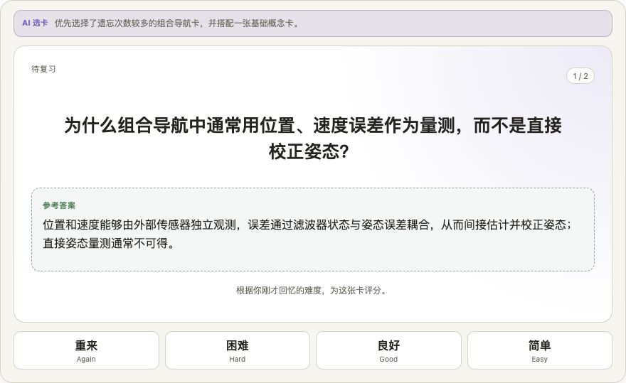
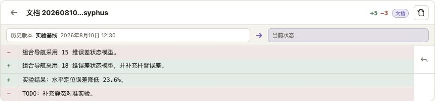
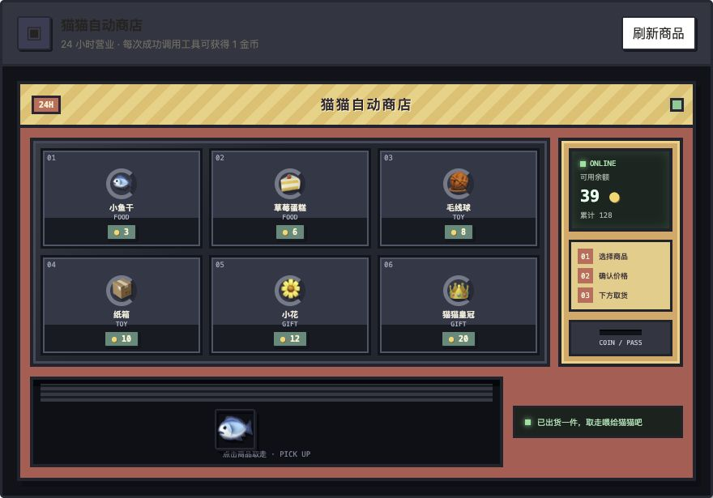

# SiYuan Sisyphus MCP & CLI

<p align="left">
  <a href="https://www.npmjs.com/package/siyuan-sisyphus">
    
  </a>
  <a href="https://github.com/yangtaihong59/siyuan-plugins-mcp-sisyphus/blob/main/LICENSE">
    
  </a>
  <a href="https://yangtaihong59.github.io/siyuan-plugins-mcp-sisyphus/">
    
  </a>
  <a href="https://github.com/yangtaihong59/siyuan-plugins-mcp-sisyphus/releases">
    
  </a>
</p>

<p align="left">
  <a href="https://github.com/yangtaihong59/siyuan-plugins-mcp-sisyphus/blob/main/README.md">English</a> |
  <a href="https://github.com/yangtaihong59/siyuan-plugins-mcp-sisyphus/blob/main/README_zh_CN.md">中文</a> |
  <a href="https://yangtaihong59.github.io/siyuan-plugins-mcp-sisyphus/">Documentation</a>
</p>

> 连接外部 AI Agent、Sisyphus 原有工具与思源官方 MCP 插件生态。

> **最新版本：**`v0.6.3` — 新增思源原生语义搜索、嵌入模型与索引管理设置页，以及安全的同级文档排序；同时修复 stdio transport 打包问题，并扩展导入迁移、视觉资源与系统安全 Skills。感谢 [@adminclaw](https://github.com/adminclaw) 提交 [PR #47](https://github.com/yangtaihong59/siyuan-plugins-mcp-sisyphus/pull/47)，感谢 [@LoneFireBlossom](https://github.com/LoneFireBlossom) 提交 [PR #49](https://github.com/yangtaihong59/siyuan-plugins-mcp-sisyphus/pull/49)。CLI 提升至 `v0.2.5`。

## 项目方向调整

SiYuan Sisyphus 最初诞生于一个朴素的愿望：让思源笔记能够连接外部 AI Agent，补强当时思源在 AI 工具接入方面的能力。

如今，思源已经推出官方 MCP，Sisyphus 在连接思源与外部 AI Agent 方面的阶段性使命也已告一段落。在官方 MCP 生态仍处于起步阶段的当下，Sisyphus 的重心将逐步转向：持续打磨 AI 与思源之间的连接体验，探索更加自然、高效、可靠的 AI 辅助工作流。

目前，Sisyphus 在延续原有能力与工作流的同时，已经接入思源官方 MCP 生态，能够调用和管理其他插件注册的 Tool，让不同插件提供的能力可以被 AI 统一发现、灵活组合并协同使用。

这不是对原有能力的替换：

- Sisyphus 自带的 14 个聚合工具、参数约定、笔记本权限和现有 Agent 工作流继续保持兼容；
- Sisyphus 已接入思源官方 MCP 端点，会发现并加载其他插件注册的 Tool；
- 思源官方原生 MCP Tool 也可以选择接入，但由于权限边界不同，默认关闭；
- 权限管理、文档时间线、多种连接方式等增强能力继续维护。


> 架构概览：外部 AI Agent 连接 Sisyphus；聚合工具通过 `/api/*` 访问思源工作空间，`extension` 则通过官方 `/mcp` 端点桥接其他插件注册的 Tool。思源原生 MCP Tool 为可选能力，默认关闭。

架构边界保持明确：Sisyphus 自带的 `fs`、时间线、权限管理、CLI、文档工具及其他聚合能力始终只调用思源 `/api/*`，不依赖官方 MCP。`/mcp` 只属于 `extension`，用于发现和转发其他插件注册的 Tool，以及用户主动开启的思源原生 Tool。

## 一次连接，两套兼容工具生态

| 工具来源 | 默认状态 | 适合场景 | 兼容与安全边界 |
|---|---|---|---|
| **Sisyphus 聚合工具** | 开启 | 稳定的阅读、搜索、编辑、数据库、权限和自动化工作流 | 保持原有 action 与参数约定，经过 Sisyphus 权限和危险操作控制 |
| **官方插件 MCP Tool** | 开启 | 使用其他思源插件通过官方 MCP 注册的新能力 | 由 `extension` 动态发现，官方工具名直接成为 action |
| **思源原生 MCP Tool** | 关闭 | 本机可信环境中的官方能力测试与对比 | 直接使用管理员会话或 API Token，不经过 Sisyphus 笔记本权限和危险操作确认 |

对已有用户来说，不需要把原来的 Sisyphus 调用改写成官方 Tool。原有工具继续可用；官方插件工具是在同一连接上增加的新生态入口。

对插件开发者来说，只要 Tool 已注册到思源官方 MCP，Sisyphus 就可以通过官方注册表发现它，无需再为 Sisyphus 单独实现一份适配。

## 这是什么

SiYuan Sisyphus 让外部 AI Agent 连接思源，并安全地阅读、搜索、编辑和整理工作空间。

它同时提供两种入口：

- **MCP 插件**：把思源连接到 Claude Desktop、Claude Code、Codex、Cursor、Cherry Studio、Cline 等支持 MCP 的客户端，并桥接官方 MCP 插件生态。
- **CLI `siyuan-sisyphus`**：让 Agent、终端和脚本用短命令直接操作思源，适合单次任务和自动化。

两种入口共享同一套底层思源操作能力。Sisyphus 自有工具共享同一套权限模型；通过 `extension` 转发的官方工具遵循其自身权限语义。

## 快速开始

1. 从思源集市安装插件，或按照开发文档从源码构建。
2. 打开 `插件 -> SiYuan Sisyphus MCP & CLI -> 设置`。
3. 在连接配置页选择 MCP 或 CLI。
4. 复制自动生成的客户端配置，或用 `siyuan-sisyphus init` 初始化 CLI。
5. 先执行列出笔记本、读取思源版本等只读任务验证连接。
6. 如需使用其他插件注册的官方 MCP Tool，在工具设置中展开“扩展工具”查看发现状态。

```bash
npm i -g siyuan-sisyphus
siyuan-sisyphus init
sisyphus notebook list
```

完整安装和连接步骤请查看[快速开始文档](./docs/zh/getting-started/index.md)。

## 核心能力

- **官方 MCP 插件生态接入**：发现其他插件通过思源官方 MCP 注册的 Tool，并在外部 Agent 连接中同步暴露。
- **兼容历史 Agent 工作流**：Sisyphus 原有聚合工具、action、CLI 和权限配置继续保留。
- **AI 友好的笔记访问方式**：`fs` 支持 `/笔记本/项目/文档` 这类人类可读路径，让 AI 不必理解块 ID 和文档树细节。
- **MCP 与 CLI 双入口**：MCP 适合多步 Agent 工作流，CLI 适合脚本、自动化和小型单次任务。
- **笔记本级安全边界**：每个笔记本可独立设置 `none`、`r`、`rw`、`rwd` 权限。
- **低上下文工具设计**：把 100+ 个思源能力收敛为 14 个按 action 路由的聚合工具，详细说明按需读取。
- **面向 Agent 的场景 Skill**：内置浏览、编辑、搜索、数据库、导出、标签、闪卡、文档时间线、系统安全和思源排版指南。
- **MCP Apps 交互界面**：闪卡复习、文档时间线和猫猫商店分别由专用启动 Tool 打开一次；普通聚合 Tool 不再重复生成 App，人工 action 在独立“App 软件”设置页管理。
- **类 Git 文档时间线**：为单篇文档创建命名时间线节点，比较历史快照并按需回退。
- **实用连接配置**：设置页提供常见 AI 客户端、本地、远程和 Docker 场景的连接片段。

## MCP Apps：把工具工作流直接放进对话

v0.6.0 为能够协商 `io.modelcontextprotocol/ui` 的客户端新增了三个内联 MCP App。需要连续交互的任务不必再拆成长串聊天消息：Agent 先准备一次上下文，再打开一个专注的界面，由用户直接完成后续操作。

| App | 专用启动 Tool | 在 App 中可以做什么 |
|-----|---------------|---------------------|
| 闪卡复习 | `flashcard_review_session` | Agent 从一份固定且经过权限检查的到期候选快照中选择 1–20 张卡；用户逐张显示答案并选择重来 / 困难 / 良好 / 简单，不会提前在聊天中泄露后续卡片。完成后还可以让 Agent 讲解本轮内容。 |
| 文档时间线 | `timeline_app` | 浏览和创建命名节点，对比历史快照与当前文档，查看紧凑的块级 Diff，并回退整篇文档或受支持的单个块。传入 `documentId` 才会打开目标文档的时间线；省略时会明确进入“仅全局”视图，只能看到全局节点。回退使用原位置二次点击确认，按钮不会因提示出现而离开鼠标位置。 |
| 猫猫商店 | `mascot_shop_app` | 浏览像素风自动售货机，把商品放入取货口，并在真正取走时完成购买；购买成功后，桌面猫猫会同步展示商品和爱心动画。 |

<p align="center">
  
</p>
<p align="center"><em>闪卡复习：Agent 负责选卡，用户显示答案并完成四档自评。</em></p>

<p align="center">
  
</p>
<p align="center"><em>文档时间线：在一个紧凑 Diff 中检查新增、删除和修改，并按需恢复。</em></p>

<p align="center">
  
</p>
<p align="center"><em>猫猫商店：选择商品后从取货口领取，购买结果会同步给桌面猫猫。</em></p>

三个 App 采用刻意分离的交互模型：

- **一个启动器只打开一次 App**：只有专用启动 Tool 携带 UI 资源；普通 `flashcard`、`timeline`、`mascot` 调用仍是数据工具，不会重复生成 App 面板。
- **Agent 负责准备，用户负责决定**：App 打开后会成为本轮唯一交互界面；模型不会代替用户回答闪卡、选择评分、回退笔记或购买商品。
- **人工操作权限独立管理**：App action 通过 `visibility: ["app"]` 对模型隐藏，并可在“设置 → MCP → App 软件”中逐项启用。笔记本权限、action 开关以及高风险操作的服务端确认仍然生效。
- **平滑兼容旧客户端**：未声明 MCP Apps 支持的客户端不会收到启动器和 App-only action；原有聚合工具响应、`structuredContent` 与独立 CLI 行为保持不变。

进一步了解可阅读[闪卡复习](./docs/zh/reference/tools/flashcard.md)、[时间线 App](./docs/zh/reference/tools/timeline.md)和[猫猫商店](./docs/zh/reference/tools/mascot.md)说明。

## 官方 MCP 生态接入

在思源 3.7.0+ 中，`extension` 会读取官方 `/mcp` 注册表，并把允许暴露的官方 Tool 转换为动态 action：

```json
{
  "action": "plugin__example__search",
  "arguments": {
    "action": "query",
    "keyword": "MCP"
  }
}
```

下游 Tool 的参数全部放在 `arguments` 中，因此即使它也使用 `action` 字段，也不会与 Sisyphus 的外层路由冲突。

工具设置页可以查看插件/原生 Tool 数量、当前暴露数量、Schema 体积、来源和风险提示，也可以单独关闭不希望暴露的 Tool。

连接采用版本检测和惰性发现：Sisyphus 先通过 `/api/system/version` 获取思源版本；低于 3.7.0 时不会请求 `/mcp`。只有启用 `extension` 或在设置页查看、刷新扩展工具时才会连接官方端点。外层 MCP Server 的首次工具列表不会等待发现完成；成功后会缓存结果并通知客户端更新工具列表，后续 `tools/list` 不会强制刷新。

如果 `/mcp` 不可用，Sisyphus 只隐藏动态扩展 action，不影响其余聚合工具，也不会阻塞外层 MCP Server 启动。官方 MCP 集成不会提高整个插件的安装门槛，`minAppVersion` 继续保持 2.9.0。

> **安全提示：**官方插件 Tool 以及可选的思源原生 Tool 不经过 Sisyphus 自有工具的笔记本权限和 action 级危险操作控制。尤其是原生 Tool，应只在本机或完全可信的客户端中启用。

详细调用方式请看 [`extension` 工具文档](./docs/zh/reference/tools/extension.md)。

## 类 Git 文档时间线

<p align="center">
  
</p>
<p align="center"><em>左侧文档快照负责节点管理，右侧文档 Diff 按需完成对比与回退。</em></p>

文档时间线给普通思源文档补上一层类似源码版本管理的安全网：

- 创建仅属于当前文档的节点，或创建所有文档可见的全局节点；
- 左侧“文档快照”采用类似 VSCode Source Control 的紧凑折叠分区，默认展开；
- 点击快照节点后自动打开右侧“文档 Diff”，创建节点则只刷新并高亮，不打断当前 Diff；
- 通过圆点颜色和“文档 / 全局”徽标识别节点作用域，并按时间混合排列；
- 可删除文档或全局节点：删除只移除用于保护节点的 tag，底层快照仍保留；
- 对比历史快照与当前文档；
- 在统一 diff 和并排 diff 之间切换；
- 使用变更缩略导航，并折叠未变化块；
- 在“旧版全局节点”档案中保留旧时间线，可将同一旧节点关联到多个文档，或安全转换为新的全局节点；
- 回退整篇文档，或单独恢复部分已解析块。

快照页只读取 attrs 与 tag 元数据；仅在选择节点后，Diff 页才创建一次当前状态快照并计算该节点差异。底层仍基于思源全数据空间快照：文档节点归属记录在文档属性中，全局节点由 tag 恢复。它不是完整 Git 替代品，也不是完整源码管理工作流。

MCP 客户端和独立 CLI 可通过 [`timeline` 聚合工具](./docs/zh/reference/tools/timeline.md) 使用同一工作流。AI 直接调用的节点删除与两种回退 action 均为高危操作并默认关闭；MCP App 的人工写操作使用独立权限，可允许用户点击回退而不向 AI 开放回退 Tool。

## MCP 与 CLI 双入口

当 AI 客户端需要自动发现工具、组合多步操作并验证结果时，使用 **MCP**。它适合搜索、阅读、修改、检查数据库以及调用官方插件 Tool 等 Agent 工作流。

当一个终端命令就够时，使用 **CLI**。它不会把长工具 Schema 塞进模型上下文，更适合脚本、自动化和小型单次任务。

MCP 和 CLI 共用 Sisyphus 核心调用路径，避免同一能力在两套入口中产生不同语义。

### MCP 2026-07-28 兼容

服务端已迁移到 MCP TypeScript SDK v2。`stdio` 会自动服务新旧两代协议；HTTP 使用 SDK 标准分类器分流：MCP 2026-07-28 请求采用无会话、逐请求元数据模型，2025 代客户端继续使用原有隔离的 `mcp-session-id` 会话。内置的思源官方 MCP 桥接会自动协商双方支持的最新版本，并在必要时回退到旧协议。

modern 协议下的高危调用使用 MCP 多轮输入确认：支持 elicitation 的客户端返回明确同意之前，操作不会下发。旧客户端为兼容性继续沿用 instructions/帮助文案确认边界。浏览器请求会校验 Origin；额外允许的来源主机可通过 `SIYUAN_MCP_ALLOWED_ORIGINS` 配置。

## 面向 Agent 的场景 Skill

MCP Server 内置了浏览、编辑、搜索、数据库、导出、标签、闪卡、文档时间线、系统安全和思源排版等场景指南。普通 MCP 客户端无需安装任何 Skill：先读取 `siyuan://skills/index`，再加载匹配的 `siyuan://skills/{name}` 资源即可。时间线任务可直接加载 `siyuan://skills/siyuan-mcp-timeline`，或调用 `siyuan_timeline` Prompt。对应的 MCP Prompts 是由用户显式调用的工作流入口，不会自动生效。

支持安装 `SKILL.md` 包的 Agent 可以把同一套指南安装到本地：

```bash
siyuan-sisyphus skill install --bundle mcp # MCP 调用约定
siyuan-sisyphus skill install --bundle all # 同时安装 MCP 与 CLI 两套
```

为保持兼容，不带 `--bundle` 的 `siyuan-sisyphus skill install` 仍默认安装 CLI Skill。Skill 负责工作流与安全决策；当前参数的真相源仍是 `siyuan://help/action/{tool}/{action}`（或对应的 `action="help"` 响应）。

草案 SEP-2640 Skills-over-MCP 在 HTTP 与 stdio 传输中均默认开启，并会发布全部内置工作流 Skill。插件内置 HTTP 服务可在“连接配置 → HTTP/HTTPS 连接 → Skills over MCP”中开关，保存后会重启服务。独立启动服务端时可通过 `SIYUAN_MCP_SKILLS_EXTENSION=false` 显式关闭。启用后服务端声明 `io.modelcontextprotocol/skills`，实现 `skills/list`、`skills/get`，并提供带 SHA-256 完整性清单的 `skill://.../SKILL.md` 资源。由于 SEP-2640 仍是草案，既有 `siyuan://skills/*` Resource 与 Prompt 继续作为稳定回退。

仓库还提供独立的 Codex Agent Plugin 包装：[`agent-plugin/siyuan-sisyphus`](./agent-plugin/siyuan-sisyphus)。它连接默认本机 HTTP 端点并打包同一组 5 个入口 Skill；若端点启用了 Bearer Token，请在客户端侧单独配置认证。

## 安全边界

Sisyphus 自有工具的默认设计是让用户明确控制 AI 的操作范围：

- 每个笔记本都可以设为只读、可写、可删除，或完全隐藏；
- 删除、移动、替换、上传资源等危险动作会被单独处理；
- “设置 → MCP → 设置与调试”中的“严格安全写入”默认开启：修改型 action 必须先以 `validateOnly=true` 获取当前状态哈希，再携带新的 UUIDv7 `requestId` 和对应 `expected*Hash` 提交；
- 写请求在网络层只发送一次，超时或断线后返回 `outcome_unknown`，不会用一次盲目重试冒险制造重复写入；同一 `requestId` 的已提交请求会从元数据账本返回重放结果；
- 严格模式不创建思源数据快照。它使用目标状态哈希、串行协调、提交后读回和仅含哈希/ID 的幂等账本；通知、同步、导出和第三方 Tool 等不可读回的外部副作用会明确标记为“不提供严格保证”；
- MCP 与 CLI 共用核心行为，切换入口不会产生第二套权限模型；
- 远程和 Docker 场景通过思源 HTTP API 操作，不假设可以直接读写本地工作空间文件。

完整调用协议、错误语义和当前边界见[严格安全写入](./docs/zh/reference/write-safety.md)。独立 CLI 与 stdio 严格写入会转交插件内置 HTTP 服务中的唯一协调器；因此严格模式下必须保持该 HTTP 服务开启。关闭开关会恢复旧参数和直接调用行为，但写响应会明确标记为非严格保证。

官方 MCP 桥接属于另一条工具来源。转发调用使用当前思源管理员会话或 API Token 的权限，不会自动继承上述笔记本权限和危险 action 控制。启用或调用前，请确认外部 Agent、网络环境和下游 Tool 都值得信任。

## 未来方向与欢迎反馈

接下来项目将重点改善外部 Agent 连接思源时的完整体验，包括：

- 常见 Agent 的连接配置与兼容性；
- HTTP、stdio、本地、远程和 Docker 场景；
- 官方 MCP Tool 的发现、同步、筛选与 Schema 体积；
- 更清晰的调用状态、错误信息和断线恢复；
- 更适合真实任务的 Skill、帮助和渐进式披露；
- 不同 Agent 产品中的实际调用验证与体验对比。

欢迎提交 bug、使用体验和修改建议：

- [GitHub Issues](https://github.com/yangtaihong59/siyuan-plugins-mcp-sisyphus/issues)：适合公开讨论问题、需求和设计建议；
- 内置 `feedback` 工具：Agent 可以直接调用 `feedback(action="submit", description="...")` 提交体验反馈。

反馈时请不要包含 API Token、密钥、私密笔记内容或敏感本地路径。

## 继续阅读

- [快速开始](./docs/zh/getting-started/index.md)
- [常见任务](./docs/zh/reference/common-tasks.md)
- [工具参考](./docs/zh/reference/index.md)
- [权限模型](./docs/zh/reference/permissions.md)
- [严格安全写入](./docs/zh/reference/write-safety.md)
- [开发文档](./docs/zh/development/index.md)
- [English README](./README.md)

## 赞赏支持

如果你觉得这个项目对你有帮助，欢迎赞赏支持！
给孩子买点 token 吧！

### 赞助致谢

感谢 **undefined**、**Fngd Z**、**ou**、**米建**、**锋🌀☁️** 、**wooh**和其他好心人对本项目的赞助支持。

<p align="left">
  
</p>

## 许可证

MIT
